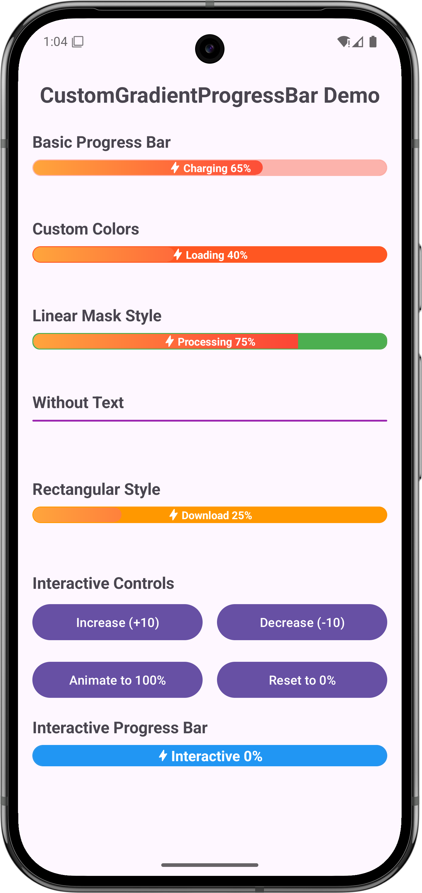

# CustomGradientProgressBar

一個功能豐富的Android漸層進度條庫，提供優美的動畫效果和高度的自訂性。

## App Screenshot



## 功能特色

- ✨ **漸層背景**: 支援自訂漸層背景
- 🎭 **圓弧遮罩**: 獨特的右側圓弧遮罩效果
- 🎨 **高度自訂**: 支援顏色、尺寸、動畫等全方位自訂
- 📱 **易於使用**: 完整的XML屬性支援，可純粹透過XML配置
- 🔄 **流暢動畫**: 支援進度變化動畫效果
- 📝 **文字支援**: 內建文字顯示，支援icon和自訂樣式
- 🎪 **多種樣式**: 支援圓角和矩形兩種基本樣式
- 🎯 **多種遮罩**: 支援圓弧和線性兩種遮罩效果

## 安裝方式

### 1. 加入依賴

在你的 `app/build.gradle` 文件中加入：

```gradle
dependencies {
    implementation 'com.shigaga:gradient-progressbar:1.0.0'
}
```

### 2. 在XML中使用

```xml
<com.shigaga.gradientprogressbar.CustomGradientProgressBar
    android:id="@+id/progressBar"
    android:layout_width="match_parent"
    android:layout_height="48dp"
    app:progressBarText="Loading 65%"
    app:progressBarInitialProgress="65"
    app:progressBarCornerRadius="12dp"
    app:progressBarMaskColor="#FF5722"
    app:progressBarStrokeColor="#FF5722" />
```

## 使用方式

### 基本使用

```kotlin
// 設定進度 (帶動畫)
progressBar.setProgress(80, true)

// 設定文字
progressBar.setText("Processing 80%")

// 設定顏色
progressBar.setMaskColor(Color.BLUE)
progressBar.setStrokeColor(Color.BLUE)
```

### XML屬性配置

#### 文字配置
```xml
app:progressBarText="Loading..."               <!-- 顯示文字 -->
app:progressBarTextSize="14sp"                 <!-- 文字大小 -->
app:progressBarTextColor="@color/white"        <!-- 文字顏色 -->
app:progressBarTextIcon="@drawable/ic_icon"    <!-- 文字旁的icon -->
app:progressBarTextVisible="true"              <!-- 是否顯示文字 -->
```

#### 外觀配置
```xml
app:progressBarCornerRadius="12dp"             <!-- 圓角半徑 -->
app:progressBarBackground="@drawable/bg"       <!-- 背景drawable -->
app:progressBarMaskColor="#FF5722"             <!-- 遮罩顏色 -->
app:progressBarStrokeColor="#FF5722"           <!-- 邊框顏色 -->
app:progressBarStrokeWidth="2dp"               <!-- 邊框寬度 -->
app:progressBarHeight="48dp"                   <!-- 高度 -->
```

#### 動畫配置
```xml
app:progressBarAnimationDuration="800"         <!-- 動畫時長(毫秒) -->
app:progressBarAnimationEnabled="true"         <!-- 是否啟用動畫 -->
```

#### 進度配置
```xml
app:progressBarInitialProgress="50"            <!-- 初始進度 -->
app:progressBarMaxProgress="100"               <!-- 最大進度值 -->
```

#### 樣式配置
```xml
app:gradientProgressBarStyle="rounded"                 <!-- 進度條樣式: rounded/rectangular -->
app:gradientProgressBarStyle="arc"                 <!-- 遮罩樣式: arc/linear -->
```

## API參考

### 進度控制
| 方法 | 說明 |
|------|------|
| `setProgress(progress: Int, animate: Boolean)` | 設定進度值 |
| `getProgress(): Int` | 取得當前進度 |
| `setMaxProgress(maxProgress: Int)` | 設定最大進度值 |
| `getMaxProgress(): Int` | 取得最大進度值 |

### 文字設定
| 方法 | 說明 |
|------|------|
| `setText(text: String)` | 設定顯示文字 |
| `getText(): String` | 取得當前文字 |
| `setTextSize(textSizeSp: Float)` | 設定文字大小(SP) |
| `setTextColor(color: Int)` | 設定文字顏色 |
| `setTextIcon(iconRes: Int)` | 設定文字旁的icon |
| `setTextVisible(visible: Boolean)` | 設定文字是否可見 |

### 外觀設定
| 方法 | 說明 |
|------|------|
| `setMaskColor(color: Int)` | 設定遮罩顏色 |
| `setStrokeColor(color: Int)` | 設定邊框顏色 |
| `setStrokeWidth(strokeWidthDp: Float)` | 設定邊框寬度(DP) |
| `setCornerRadius(cornerRadiusDp: Float)` | 設定圓角半徑(DP) |
| `setBackgroundDrawable(backgroundRes: Int)` | 設定背景drawable |

### 動畫和樣式
| 方法 | 說明 |
|------|------|
| `setAnimationDuration(durationMs: Long)` | 設定動畫時長 |
| `setAnimationEnabled(enabled: Boolean)` | 啟用/停用動畫 |
| `setMaskStyle(maskStyle: MaskStyle)` | 設定遮罩樣式 |
| `setProgressBarStyle(style: ProgressBarStyle)` | 設定進度條樣式 |

## 樣式選項

### ProgressBarStyle
- `ROUNDED`: 圓角樣式（預設）
- `RECTANGULAR`: 矩形樣式

### MaskStyle  
- `ARC`: 圓弧遮罩效果（預設）
- `LINEAR`: 線性遮罩效果

## 使用範例

### 範例1: 基本進度條
```xml
<com.shigaga.gradientprogressbar.CustomGradientProgressBar
    android:layout_width="match_parent"
    android:layout_height="48dp"
    app:progressBarText="Charging 65%"
    app:progressBarInitialProgress="65"
    app:progressBarCornerRadius="12dp" />
```

### 範例2: 自訂顏色
```xml
<com.shigaga.gradientprogressbar.CustomGradientProgressBar
    android:layout_width="match_parent"
    android:layout_height="48dp"
    app:progressBarText="Loading 40%"
    app:progressBarInitialProgress="40"
    app:progressBarMaskColor="#FF5722"
    app:progressBarStrokeColor="#FF5722"
    app:progressBarCornerRadius="24dp" />
```

### 範例3: 線性遮罩樣式
```xml
<com.shigaga.gradientprogressbar.CustomGradientProgressBar
    android:layout_width="match_parent"
    android:layout_height="48dp"
    app:progressBarText="Processing 75%"
    app:progressBarInitialProgress="75"
    app:progressBarMaskStyle="linear"
    app:progressBarMaskColor="#4CAF50"
    app:progressBarStrokeColor="#4CAF50" />
```

### 範例4: 程式化控制
```kotlin
class MainActivity : AppCompatActivity() {
    private lateinit var progressBar: CustomGradientProgressBar
    
    override fun onCreate(savedInstanceState: Bundle?) {
        super.onCreate(savedInstanceState)
        setContentView(R.layout.activity_main)
        
        progressBar = findViewById(R.id.progressBar)
        
        // 設定初始狀態
        progressBar.setProgress(0, false)
        progressBar.setText("Ready")
        
        // 開始載入
        startLoading()
    }
    
    private fun startLoading() {
        val handler = Handler(Looper.getMainLooper())
        var progress = 0
        
        val runnable = object : Runnable {
            override fun run() {
                progress += 10
                progressBar.setProgress(progress, true)
                progressBar.setText("Loading $progress%")
                
                if (progress < 100) {
                    handler.postDelayed(this, 500)
                } else {
                    progressBar.setText("Complete!")
                }
            }
        }
        
        handler.post(runnable)
    }
}
```

## 注意事項

1. **最小API版本**: Android API 21 (Android 5.0)
2. **動畫效果**: 建議在主線程中呼叫進度更新方法
3. **性能考量**: 頻繁的進度更新可能影響性能，建議合理控制更新頻率
4. **記憶體管理**: View會自動處理動畫的生命週期，無需手動清理

## 專案結構

```
GradientProgressBar/
├── app/                          # 範例應用程式
├── gradientprogressbar/          # 主要library模組
│   ├── src/main/
│   │   ├── java/                 # Kotlin原始碼
│   │   └── res/                  # 資源檔案
│   └── src/test/                 # 單元測試
├── README.md                     # 說明文件
└── build.gradle.kts             # 專案配置
```

## 授權條款

```
Copyright 2024 Howard

Licensed under the Apache License, Version 2.0 (the "License");
you may not use this file except in compliance with the License.
You may obtain a copy of the License at

    http://www.apache.org/licenses/LICENSE-2.0

Unless required by applicable law or agreed to in writing, software
distributed under the License is distributed on an "AS IS" BASIS,
WITHOUT WARRANTIES OR CONDITIONS OF ANY KIND, either express or implied.
See the License for the specific language governing permissions and
limitations under the License.
```

## 貢獻指南

歡迎提交Issues和Pull Requests！

1. Fork這個專案
2. 建立你的功能分支 (`git checkout -b feature/AmazingFeature`)
3. 提交你的變更 (`git commit -m 'Add some AmazingFeature'`)
4. 推送到分支 (`git push origin feature/AmazingFeature`)
5. 開啟一個Pull Request

## 版本記錄

### v1.0.0
- 初始版本發布
- 支援基本進度條功能
- 支援漸層背景和圓弧遮罩
- 完整的XML屬性支援
- 動畫效果支援

## 支持開發

如果這個庫對您有幫助，您可以通過以下方式支持開發：

### ⭐ Star this project
給我一個星星是最好的支持！


### ☕ Buy me a coffee
[](https://www.buymeacoffee.com/howard06285)

### 💝 Sponsor on GitHub
[](https://github.com/sponsors/howard06285)

### 🎁 PayPal Donation
[](https://paypal.me/howard06285)

**感謝您的支持！您的贊助將幫助我持續改進和維護這個專案。**